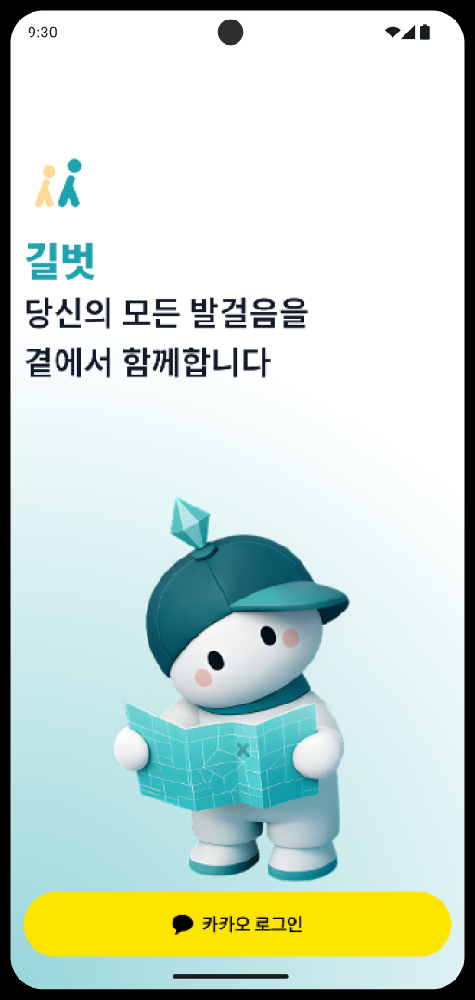
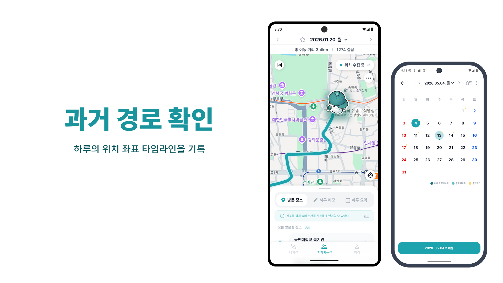
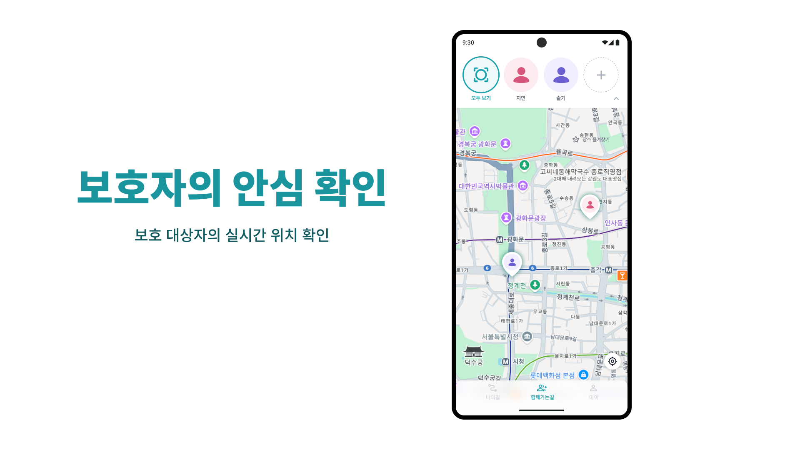
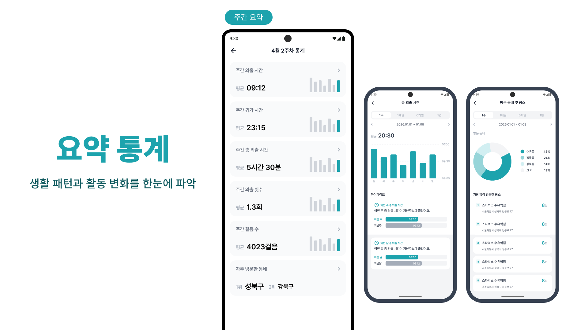
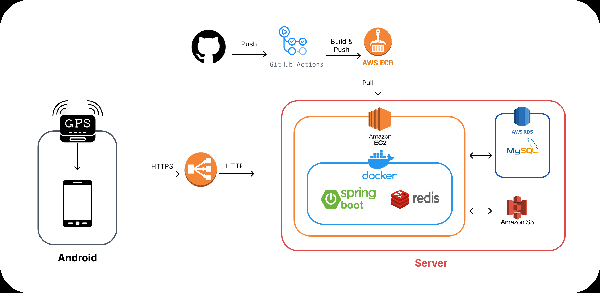
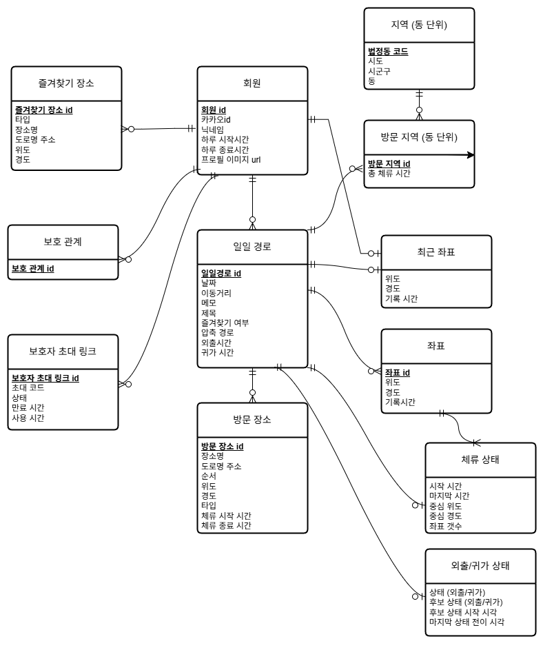

## 서비스 소개

### "당신의 하루를 대신 기억합니다"

길벗은 위치 데이터를 기반으로 사용자의 하루를 자동으로 기록하여, **기억 보조**와 **안심** 확인을 제공하는 서비스입니다.
사용자의 과거 경로를 확인할 수 있으며, 체류한 장소와 외출·귀가 시각을 자동으로 기록하여 생활 패턴을 확인할 수 있도록 돕는 서비스입니다.
 

## 시스템 아키텍처

## ERD

