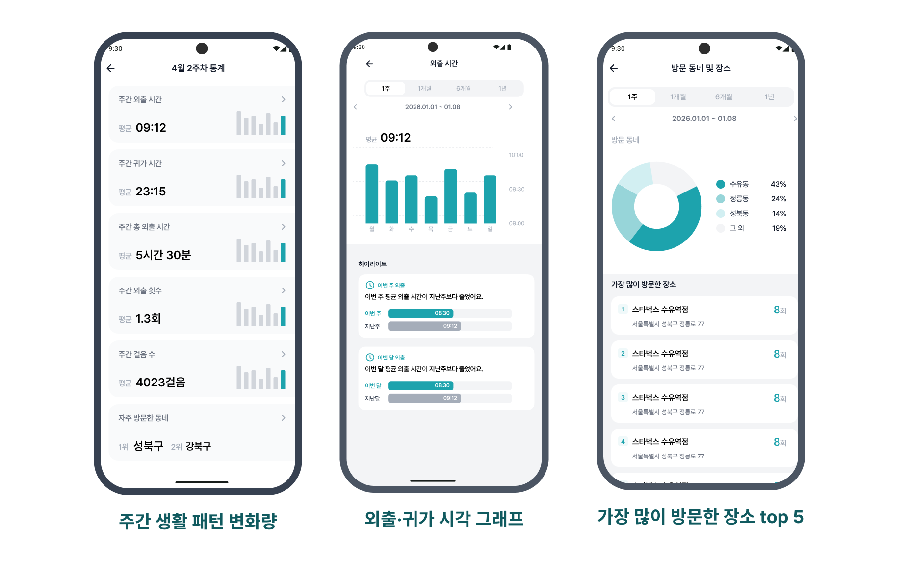
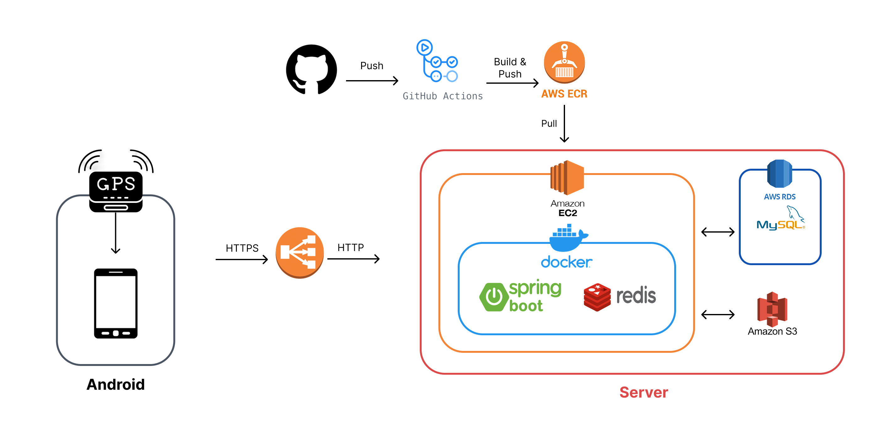

<div align="center">

<h1>
  
  길벗 - 위치 기반 기억 보조 • 보호자 안심 확인 서비스 
</h1>

</div>

<div align="center">

### 당신의 하루를 대신 기억합니다

위치 데이터를 수집해 사용자의 하루 경로를 기록 · 가공하여 개인 사용자에겐 **기억 보조**를, 보호자에겐 **안심 확인**을 제공합니다.


<br>

위치 데이터를 분석하여 15분 이상 **체류한 장소**의 상호명과 **외출 • 귀가 시각**을 자동 저장합니다.
<br>
이를 통해 사용자는 자신의 생활 패턴을 쉽게 확인할 수 있으며, 보호자는 일상 흐름을 안심하고 살펴볼 수 있습니다.

</div>

<br>

## 주요 기능
### 1️⃣ 이동 경로 기록 및 조회

- 백그라운드 위치 수집
- 날짜별 이동경로 조회
- 위치수집 on/off


### 2️⃣ 기억 보조를 위한 개인 기록 도구

- 하루 단위 메모 작성
- 학교, 회사 등 즐겨찾는 장소 등록
- 방문장소 직접 추가
- 날짜별 즐겨찾기


### 3️⃣ 위치 데이터 분석

- 위치  데이터를 분석하여 사용자에게 의미있는 정보로 변환
- 분석 기반 15분 이상 체류한 장소 상호명 및 체류 시간 저장
- 분석 기반 외출/귀가 시각 저장


### 4️⃣ 보호자 안심 확인

- 보호 대상자의 실시간 위치 확인
- 보호 대상자의 날짜별 이동 경로, 외출/귀가 시각, 체류 장소, 방문한 지역 등 확인


### 5️⃣ 요약 통계

- 기간별(1주/1개월/6개월/1년) 생활패턴 지표 변화량 파악
- 기간별 가장 많이 방문한 장소 및 지역 top 5 확인


<br>

## 시스템 아키텍처

<div align="center">


</div>

<br>

## 실행 방법

### 사전 요구사항

- Docker
- MySQL (기본 포트 `3306`, `capstone` 데이터베이스)
- Redis (기본 포트 `6379`)
- Android Studio + Android SDK (API 36), 에뮬레이터 또는 실기기 (API 24 이상)

### 1. 백엔드 실행 (Docker)

```bash
cd backend
```

`backend/.env.local` 파일을 생성하고 아래 항목을 채워 넣습니다. (실제 값은 팀 내부에서 별도로 공유받으세요)

```
DB_URL=jdbc:mysql://<DB_HOST>:3306/capstone
DB_USERNAME=
DB_PASSWORD=
JWT_SECRET=
REDIS_HOST=
REDIS_PORT=6379
KAKAO_REST_API_KEY=
NAVER_CLIENT_ID=
NAVER_CLIENT_SECRET=
DDL_AUTO=update
```

Docker 이미지를 빌드하고 컨테이너를 실행합니다.

```bash
docker build -t capstone-backend .
docker run -d --name capstone -p 8080:8080 --env-file .env.local capstone-backend
```

실행 후 아래 주소에서 API 문서를 확인할 수 있습니다.

- Swagger UI: http://localhost:8080/swagger-ui.html

### 2. Android 앱 실행

`android` 디렉토리의 `local.properties.example`을 참고하여 `android/local.properties` 파일을 생성합니다.

```properties
sdk.dir=<Android SDK 경로>
kakao.nativeAppKey=<Kakao Native App Key>
app.baseUrl=<백엔드 서버 주소, 예: http://<PC-IP>:8080/>
google.mapsApiKey=<Google Maps API Key>
```

> 실기기 또는 에뮬레이터에서 로컬 백엔드와 통신하려면 `app.baseUrl`을 `localhost`가 아닌 PC의 IP 주소로 설정해야 합니다.

Android Studio로 `android` 디렉토리를 열어 실행하거나, CLI로 아래 명령을 사용합니다.

```bash
cd android
./gradlew installDebug
```

<br>